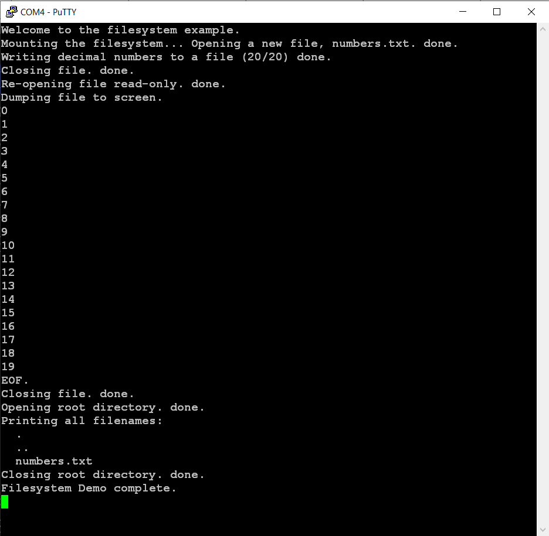

# SD card LittleFilesystem2 demo
## project name: mbed6_SD_filesystem
Tested by: **Keil Studio** 1.50 and **Mbed-OS** 6.16.0

This project demonstrates simple filesystem handling on an SD card.
We use here the LittleFileSystem2 library. It should be noted, however, 
that this filesystem does not provide compatibility with oher operating
systems like Windows, Linux od Mac OS. If compatibility is needed then use
the FatFileySystem package instead. 

The program tries to mount the filesystem first (will reformat the card if mounting fails) 
then creates a file (numbers.txt) and writes numbers from zero up to 19 into it.
After closing the file, it will be reopened for reading and the content of the file will
be listed in the terminal window.

### Reference: 
[Getting Started With The sd-driver](https://os.mbed.com/teams/mbed-os-examples/code/mbed-os-example-sd-driver/) (Mbed official example)

## Hardware requirements
* NUCLEO-F446RE development board
* SD card breakout (we used an 1.8" TFT board wich has an SD card socket on the back side)
* USB connection to a PC through the built-in ST-Link v2-1

## Wiring instructions for the NUCLEO-F446RE board

We selected the SPI3 channel for driving the SD card. 

| SD card | color | signal |pin   |
|:-------:|:----: |:-----:|:-------:|
|  DO    | blue   | MISO  | PC11    |
|  SCLK  | yellow | SCLK  | PC10    |
|  DI    | green  | MOSI  | PC12    |
|  CS    | brown  | CS    | PD2     |
|  VCC   | red    | VCC   | 5V/3.3V |
|  GND   | black  | GND   | GND     |


## Software requirements
* Start with an empty mbed 6 project
* Edit the main.cpp source file
* Configure the project by adding an **mbed_app.json** file in which
    * We have to add the **SD** component and the **STORAGE** features_add
    * We have to override the pin connections according to the selected **SPI** channel

Finally the **mbed_app.json** sholuld look like this: 

```
{
    "target_overrides": {
        "*": {
            "target.features_add": ["STORAGE"],
            "target.components_add": ["SD"],            
            "sd.SPI_MOSI" : "PC_12",
            "sd.SPI_MISO" : "PC_11",
            "sd.SPI_CLK"  : "PC_10",
            "sd.SPI_CS"   : "PD_2"
        }
    }
}
```
## mbed6_SD_filesystem results
Open a terminal window on the PC were the ST-Link v2-1 is connected to.
The default baudrate is 9600 bps. After (re)starting of the program you should se the following output:



